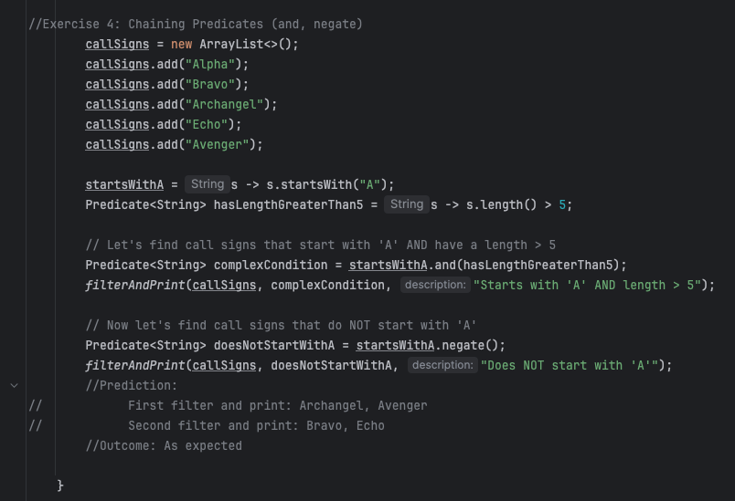

# Author: Nicholo Pardines
# Lab: Exploring Java Lambdas and Predicate

# Output

# Exercise 1: The "New Way" - A Simple Lambda Expression

# Exercise 3: Using Predicates to Filter a List

# Exercise 4: Chaining Predicates (and, negate)

